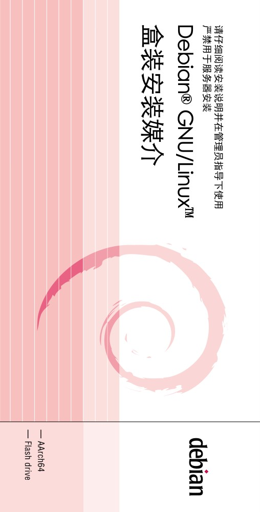
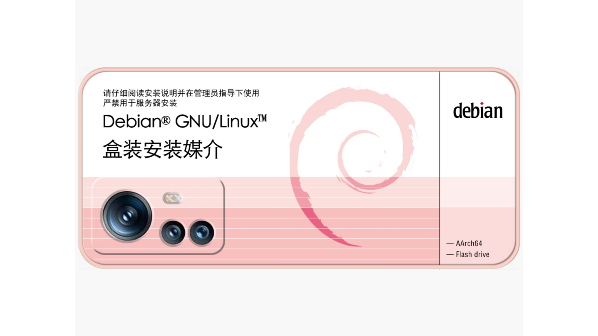

# Debian 手机壳

| 手机壳                    | 效果图                          |
|:-------------------------:|:------------------------------:|
|  |  |

## 使用

在 [release](https://github.com/execute-darker/debian-Phone-box/releases/latest) 页面下载 PNG 档案打印即可。

对于手机壳，由于各大电商平台有不同程度的图片压缩现象，其中拼多多最严重，淘宝较好，所以，建议在淘宝下单然后私聊客服直接发送 原图 png图片 即可。
 
十分欢迎您对本项目提出改进建议，提 issue 和 pr 均可（）。

[关于“严禁用于服务器安装”](https://github.com/moesoha/debian-media-box/issues/1)

## 介绍

这是一个用来包装 Debian 安装介质的盒子的平面设计。因为 Debian 的 logo 与某药品十分相似，此前就有类似的梗，如下图。

这里的设计正与之相同。

## 感谢

在此处感谢本项目的原项目还有原项目的朋友们：

  - [原项目地址](https://github.com/moesoha/debian-media-box)   
   - 原项目的朋友们：
- - 某不愿透露姓名的辣鸡嫖虫 (包装盒初稿)
  - dfceaef (包装盒文案)
  - Soha (包装盒与说明书的终稿)
  - YukariChiba (说明书创意与文案, [#3](https://github.com/moesoha/debian-media-box/issues/3))
  - IcesandSora (包装盒创意)

## LICENSE

本作品采用[知识共享署名-相同方式共享 3.0 未本地化版本许可协议](http://creativecommons.org/licenses/by-sa/3.0/)进行许可。
